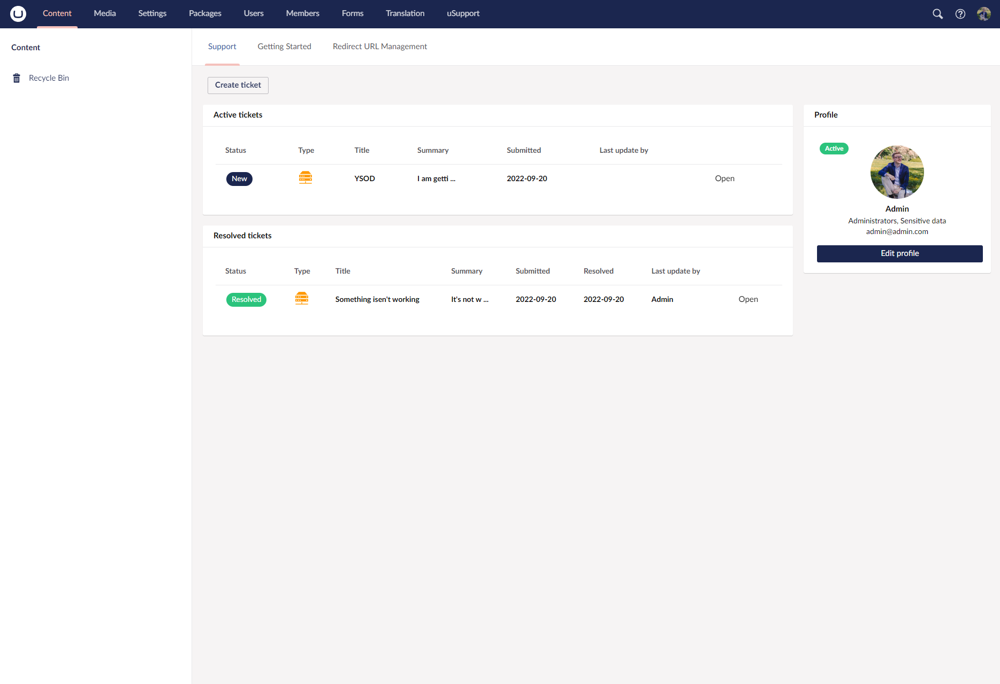
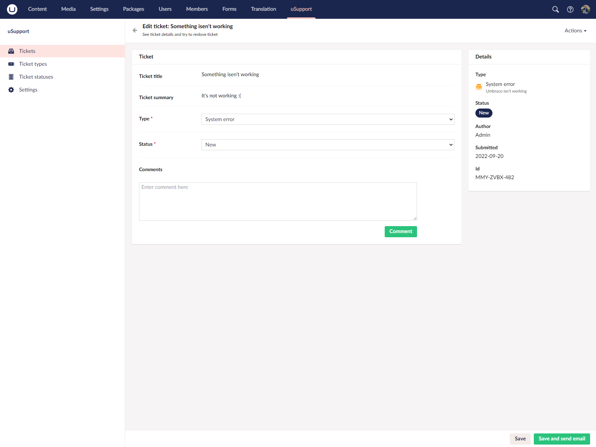
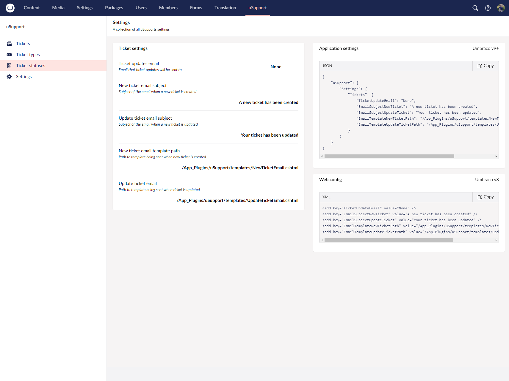

    

## What is uSupport
uSupport is an feature rich ticketing system designed specifically for the Umbraco. It is a complete ticketing solution that enables users to create, manage, and view tickets and their associated comments. With uSupport, you can quickly and easily create and manage tickets. uSupport is highly customizable, allowing users to set up their own ticket types and define ticket statuses.

## Why uSupport
Say goodbye to the days of digging through countless old emails in search of vital details. With uSupport, everything you need is neatly organized within the Umbraco environment. Streamline your workflow, boost productivity, and effortlessly access all the information you need to address and resolve client issues efficiently.

### Key features
* Friendly UI
* Customizable ticket types & statuses
* Comment on tickets
* Email notifications
* Ticketing dashboard

## Useful links
- [Documentation](https://weberistic.github.io/uSupport-documentation/)

## Contributing

If you would like to help me improve this package, feel free to create a pull request!

## Issues

If you find any issues with the package feel free to raise a issue!

## Exentions

### uSupport hub
With uSupport hub you can now connect your clients sites to a hub. The hub allows you manage all connected sites tickets. You can manage ticket, ticket types/statuses. All via the hub.

## Screenshots

